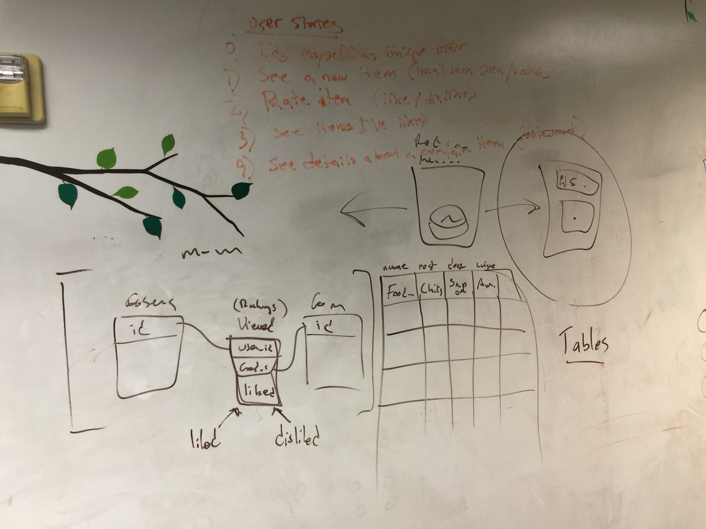

Tinder for Food
===============

##User Stories
- As a user, I should be able to login to my profile
- As a user, I should be able to see the picture of a new item (one I haven't rated)
- As a user, I should be able to rate that item (like or dislike)
- As a user, I should be able to see all the items I've liked listed out
- As a user, I should be able to select an item and see more detail about it.

##Schema

### Entities & Data Types
####users
- id (int)
- email (string)
- name (string)

####items
- id (int)
- pic_url (string)
- info_url (string)
- name (string)
- description (string)
- restaurant_id (int)
- cuisine_type (string)*   --  could be its own table

####ratings
- id (int)
- user_id (int)
- item_id (int)
- liked (bool)

####restaurants
- id (int)
- name (string)
- location (string)
- homepage_url (string)
- yelp_url (string)

##Pics
